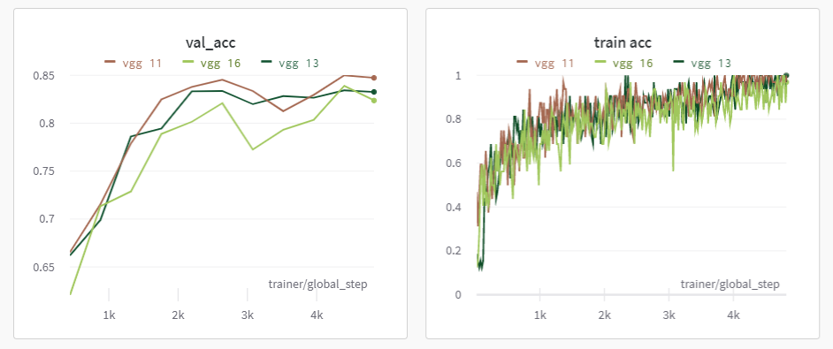

# Very Deep Convolutional Networks for Large-Scale Image Recognition

## Abstract
In this work we investigate the effect of the convolutional network depth on its accuracy in the large-scale image recognition setting. Our main contribution is a thorough evaluation of networks of increasing depth using an architecture with very small (3x3) convolution filters, which shows that a significant improvement on the prior-art configurations can be achieved by pushing the depth to 16-19 weight layers. These findings were the basis of our ImageNet Challenge 2014 submission, where our team secured the first and the second places in the localisation and classification tracks respectively. We also show that our representations generalise well to other datasets, where they achieve state-of-the-art results. We have made our two best-performing ConvNet models publicly available to facilitate further research on the use of deep visual representations in computer vision.
## Research 
You Can read the paper from [Here](https://arxiv.org/abs/1409.1556)

## Requirements:

This project uses Python 3.9

Create a virtual env with the following command:

```
conda create --name project-setup python=3.9
conda activate project-setup
```

Install the requirements:

```
pip install -r requirements.txt
```

### Training

After installing the requirements, in order to train the model simply run:

```
!python train.py --model_num = "Model num" 
```

## Monitoring 
[wandb link](https://wandb.ai/muhammed266/vgg?workspace=user-muhammed266)

### Training Info
<p align="center">
    
</p>


