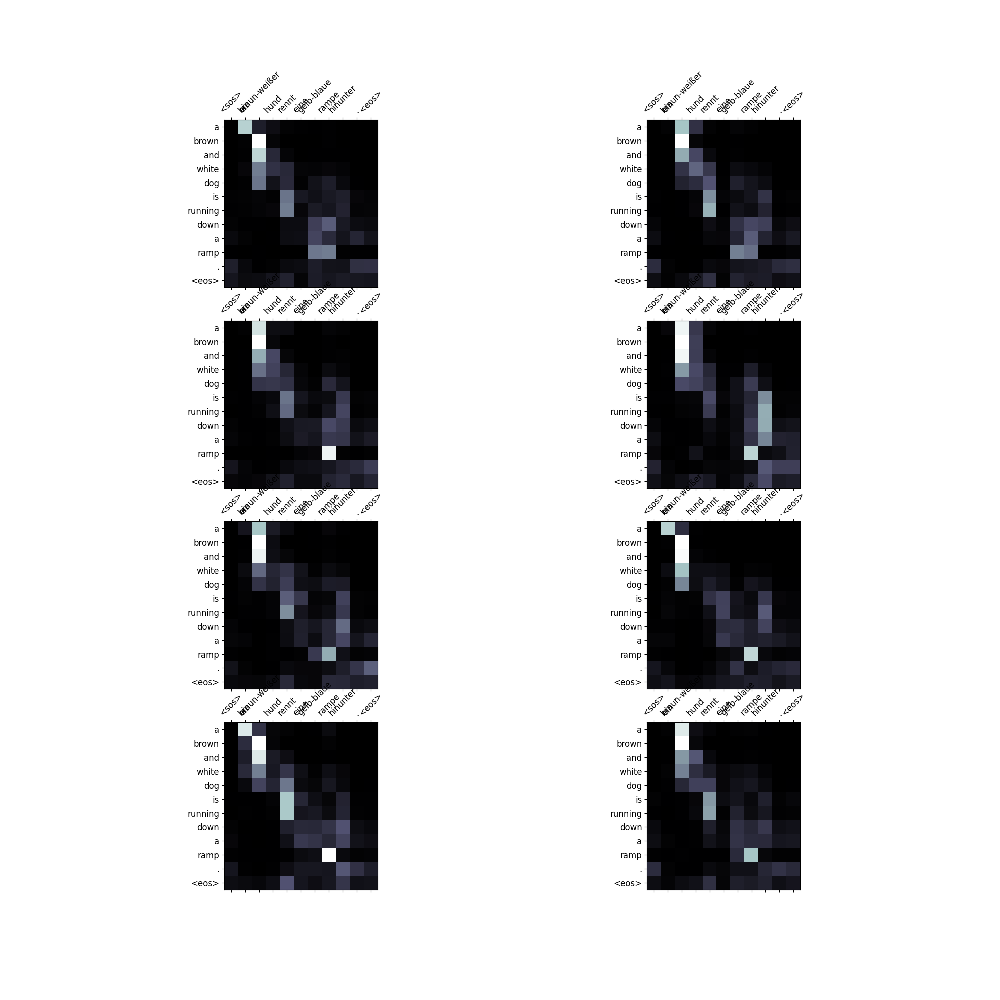

# Attention is you need

## Abstract
The dominant sequence transduction models are based on complex recurrent or convolutional neural networks in an encoder-decoder configuration. The best performing models also connect the encoder and decoder through an attention mechanism. We propose a new simple network architecture, the Transformer, based solely on attention mechanisms, dispensing with recurrence and convolutions entirely. Experiments on two machine translation tasks show these models to be superior in quality while being more parallelizable and requiring significantly less time to train. Our model achieves 28.4 BLEU on the WMT 2014 English-to-German translation task, improving over the existing best results, including ensembles by over 2 BLEU. On the WMT 2014 English-to-French translation task, our model establishes a new single-model state-of-the-art BLEU score of 41.8 after training for 3.5 days on eight GPUs, a small fraction of the training costs of the best models from the literature. We show that the Transformer generalizes well to other tasks by applying it successfully to English constituency parsing both with large and limited training data.
## Research
You Can read the paper from [Here](https://arxiv.org/abs/1706.03762?amp=1)

## Requirements:

This project uses Python 3.9

Create a virtual env with the following command:

```
conda create --name project-setup python=3.9
conda activate project-setup
```

Install the requirements:

```
pip install -r requirements.txt
```

### Training

After installing the requirements, in order to train the model update model configuration to meet your needs and simply run:

```
!python train.py
```

### Inference

After training is done, you can use this model to translate your own sentences by running inference.py :

```
!python3 inference.py --sentence 'ein mann rollt einen runden tisch über den boden.' \
           --model_path '/content/checkpoint/transformer-epoch(25).pt' \
           --tokenizers_path '/content/tokenizers/tokenizer.pickle' \
```

### visualize attention
you can visualize attention of the sentence by running inference.py with the addition of a parameter to visual it:

```
!python3 inference.py --sentence 'ein mann rollt einen runden tisch über den boden.' \
           --model_path '/content/checkpoint/transformer-epoch(25).pt' \
           --tokenizers_path '/content/tokenizers/tokenizer.pickle' \
           --visualize_attention
```
<p align="center">
    
</p>


## Monitoring
[wandb link](https://wandb.ai/muhammed266/attention-is-all-you-need?workspace=user-muhammed266)

### Training Info
<p align="center">
    
</p>
